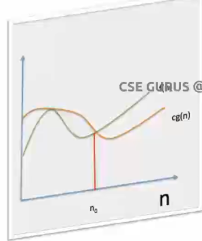

# Design and Analysis Of Algorithms

##### Notion of an Algorithm

##### Algorithm

* An Algorithm, is a sequence of unambiguous instructions to solve a problem.

    i.e, for obtaining a required output for any legitimate input in a finite amount of time.

    To obtain this, an algorithm must have some properties

    - Definiteness --> Each instruction is clear and unambiguous.
    - Effectiveness --> Every instruction must be very basic so that it can be carried out, in priciple, by a person using pencil and paper.
    - Finiteness --> If we trace out the instruction of an algorithm, then for all cases, the algorithm must terminate after a finite number of steps.
    - i/p --> 0 or more quantities are externally supplied.
    - o/p --> atleast one quantity is produced.

##### Algorithm Specification

##### Psuedo-Code Conventions

* Comments begin with // and continue until the end of line.
* Blocks are indicated with matching braces { and }.
* An identifier begins with a letter. The datatypes of variables are not explicitly declared.
* Assignment of values to variables is done using the assignment statement.
    < Variable >:=< expression >;
* There are two Boolean values TRUE and FALSE.
    - Logical Operators: AND, OR, NOT
    - Relational Operators: <, <=, >, >=, =, !=
* The following looping statements are employed.
    while, For and repeat-until
* A conditional statement has the following forms.

    - If < condition > then < statement >
    - If < condition > then < statement >
      else < statement >
    
* There is only one type procedure:
  Algorithm, contains:
  - heading
  - body

  Algorithm Name (Parameter Lists) -----> heading

  {
    ......
    ......    -----------> body
  }

  ##### Performance Analysis

  1. Space Complexity.
  2. Time Complexity.

  ##### 1. Space Complexity:
    The Space complexity of an algorithm is the amount of memory it needs to run to complete.

    Space needed by an algorithm is given by S(P) = C(fixed part) + Sp(Variable part)

    <strong>fixed part:</strong> independent of instance characteristics.
                    eg: space for simple variables, constants e.t.c.
    <strong>variable part:</strong> Space for variables whose size is dependant on particular problem instance.

    

  ##### 2. Time Complexity:
    The time complexity of an algorithm is amount of computer time it needs to run to complete.
    Time needed by an algorithm is given by T(P) = compile time + execution time.

    compile time is excluded because it can be said that a program can be compiled once and can be run any number of times.

    Therefore, Time Complexity is T(P) = tp(execution time)

    Step count:
    * For algorithm heading -> 0
    * For braces -> 0
    * For expressions -> 1
    * For any looping statements -> no.of times the loop is repeating.

##### Asymptotic Notations

  * Terminology that enables us to make meaningful statements about the time and space meaningful statements about the time and space complexities of an algorithm.
    - Big "oh" (O)
    - Big Omega(Ω)
    - Theta(θ)
    - Little "oh" (o)
    - Little Omega (ω)

##### 
Big oh(O) notation

<strong>Definition:</strong> A function f(n) is said to be in O(g(n)), denoted by f(n)= O(g(n)) is bounded above by some constant multiple of g(n) for all large n, i.e., there
exist positive constant c and non-negative integer n0 such that
  f(n) <= c * g(n) for every n>= n0

.png "Big(O)")

##### 
Ω-Notation

<strong>Definition:</strong> A funtion f(n) is said to be in Ω(g(n)), denoted by f(n) = Ω(g(n)), if f(n) is bounded below by some constant multiple of g(n) for all large n, i.e., if there exists some positive constant c and some nonnegative integer n0 such that
  f(n) >= c * g(n) for all n >= n0

##### 
θ-Notation

<strong>Definition:</strong> A function f(n) is said to be in θ(g(n)), denoted by f(n) = θ(g(n)), if f(n) is bounded both above and below by some positive constant multiples of g(n) for all large n, i.e., if there exist some positive constant c1 and c2 and some nonnegative integer n0 such that
  c2g(n) <= f(n) <= c1g(n) for all n >= n0

